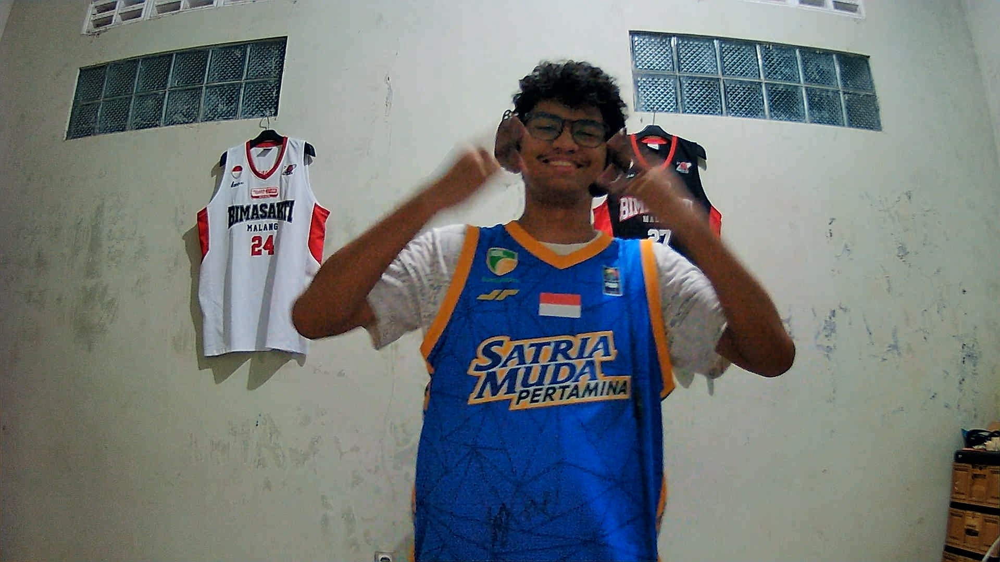
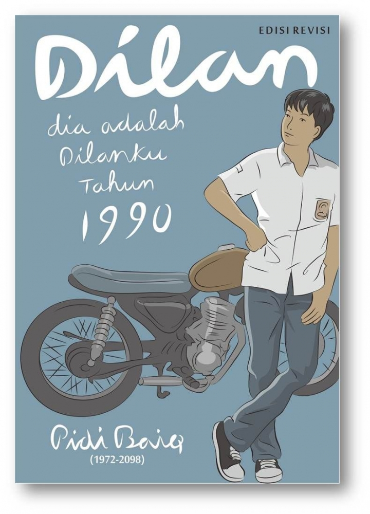
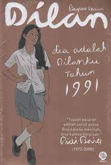
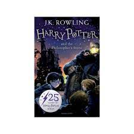
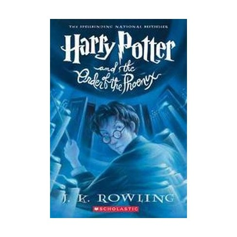
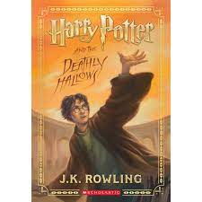
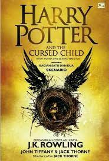

data.html

<!DOCTYPE HTML>
<html>
<head>
<title>Gallery Foto</title>
</head>

<body>

<h1>Rajeendra Fawaz Majjid Anthuryo</h1>

<i><b>You can't change what happened, but you can change what will hapen</b></i>

<a href="profile.html">Profile</a> |
<a href="gallery.html">Gallery</a> | Data

<h2><a name="TOP">Daftar Buku</a></h2>
<table width="100%" border="1">
<tr>
<th>Judul Buku</th>
<th>Pengarang</th>
<th>Foto</th>
<th>Detail</th>
</tr>
<tr>
<td>How To Build a Car</td>
<td>Adrian Newey</td>
<td> </td>
<td align="center">
<a href="#book1">How To Build a Car</a>
</td>
<tr>
<td>5cm</td>
<td>Donny Dhirgantoro</td>
<td></td>
<td align="center">
<a href="#book1">5cm</a>
</td>
</tr>
<tr>
<td>2 Garis Biru</td>
<td>Lucia Priandarini</td>
<td></td>
<td align="center">
<a href="#book3">2 Garis Biru</a>
</td>
</tr>
<tr>
<td>Dilan 1990</td>
<td>Pidi Baiq</td>
<td></td>
<td align="center">
    <a href="#book4">Dilan 1990</a>
    </td>
</tr>
<tr>
<td>Dilan 1991</td>
<td>Pidi Baiq</td>
<td></td>
<td align="center">
    <a href="#book5">Dilan</a>
    </td>
</tr>
<tr>
<td>Harry Potter and the Philosopher's Stone</td>
<td>J.K Rowling</td>
<td></td>
<td align="center">
    <a href="#book6">Harry Potter and the Philosopher's Stone</a>
    </td>
</tr>
<td>Harry Potter and the Order of the Phoenix</td>
<td>J.K Rowling</td>
<td></td>
<td align="center">
    <a href="#book7">Harry Potter and the Order of the Phoenix</a>
    </td>
</tr>
<td>Harry Potter and the Deathly Hallows</td>
<td>J.K Rowling</td>
<td></td>
<td align="center">
    <a href="#book8">Harry Potter and the Deathly Hallows</a>
    </td>
</tr>
<tr>
<td>Harry Potter and the Cursed Child</td>
<td>J.K Rowling</td>
<td></td>
<td align="center">
    <a href="#book9">Harry Potter and the Cursed Child</a>
    </td>
</tr>
<!--
salin baris tabel ini sebanyak 9 baris dan sesuaikan isinya dengan data yang ingin ditampilkan
-->
</table>

<h2>Detail Buku</h2>
<table width="100%" border="1">
<tr>
<td></td>
<td valign="top">
Judul: <a name="book1">How To Build a Car</a>  Pengarang: Adrian Newey 
"Buku 'How to Build a Car' oleh Adrian Newey adalah otobiografi yang merinci kariernya
selama 35 tahun di Formula One, termasuk desain mobil dan pengalaman dengan pembalap serta balapan
dalam dunia balap Formula One."  
<a href="#TOP">TOP</a>
</td>
</tr>
<tr>
<td></td>
<td valign="top">
Judul: <a name="book1">5cm</a>  Pengarang: Donny Dhirgantoro 
"5 cm" adalah novel Donny Dhirgantoro yang menceritakan lima sahabat
yang mendaki gunung Semeru dan menjalani pengalaman hidup. Tema utamanya
 adalah persahabatan dan pencarian makna hidup. Novel ini sangat populer
  dan dijadikan film pada tahun 2012. 
<a href="#TOP">TOP</a>
</td>
</tr>
<tr>
<td></td>
<td valign="top">
Judul: <a name="book1">2 Garis Biru</a>  Pengarang: Lucia Priandarini 
"2 Garis Biru" adalah novel Pidi Baiq yang mengisahkan kehamilan remaja 
pasangan Gery dan Frees setelah hubungan seks tanpa perlindungan, menjelajahi 
isu-isu seputar pendidikan seks dan tanggung jawab remaja.  
<a href="#TOP">TOP</a>
</td>
</tr>
<tr>
<td></td>
<td valign="top">
Judul: <a name="book1">Dilan 1990</a>  Pengarang: Pidi Baiq 
"Dilan 1990" adalah novel karya Pidi Baiq yang mengisahkan kisah cinta remaja 
antara Dilan dan Milea di tahun 1990 di Indonesia. Novel ini menggambarkan 
romantisme masa remaja dan telah diadaptasi menjadi film pada tahun 2018. 
<a href="#TOP">TOP</a>
</td>
</tr>
<tr>
<td></td>
<td valign="top">
Judul: <a name="book1">Dilan 1991</a>  Pengarang: Pidi Baiq 
"Dilan 1991" adalah sekuel dari "Dilan 1990" yang melanjutkan kisah 
cinta antara Dilan dan Milea di tahun 1991. Novel ini juga diadaptasi menjadi film. 
<a href="#TOP">TOP</a>
</td>
</tr>
<tr>
<td></td>
<td valign="top">
Judul: <a name="book1">Harry Potter and the Philosopher's Stone</a>  Pengarang: J.K Rowling 
"Harry Potter and the Philosopher's Stone" adalah novel pertama dalam seri Harry Potter oleh J.K. Rowling, 
menceritakan awal petualangan Harry Potter di Sekolah Sihir Hogwarts dalam pencarian Batu Bertuah yang berharga. 
<a href="#TOP">TOP</a>
</td>
</tr>
<tr>
<td></td>
<td valign="top">
Judul: <a name="book1">Harry Potter and the Order of the Phoenix</a>  Pengarang: J.K Rowling 
"Harry Potter and the Order of the Phoenix" adalah novel kelima dalam seri Harry Potter. Dalam buku ini, 
Harry dan teman-temannya membentuk kelompok rahasia, belajar sihir, dan menghadapi pertempuran di Departemen Sihir. 
<a href="#TOP">TOP</a>
</td>
</tr>
<tr>
<td></td>
<td valign="top">
Judul: <a name="book1">Harry Potter and the Deathly Hallows</a>  Pengarang: J.K Rowling 
"Harry Potter and the Deathly Hallows" adalah novel terakhir dalam seri Harry Potter oleh J.K. Rowling.
 Dalam buku ini, Harry, Ron, dan Hermione berusaha menghancurkan Horcruxes dan menghadapi pertempuran 
 akhir dengan Lord Voldemort. Novel ini adalah penutup epik untuk kisah Harry Potter.  
<a href="#TOP">TOP</a>
</td>
</tr>
<tr>
<td></td>
<td valign="top">
Judul: <a name="book1">Harry Potter and the Cursed Child</a>  Pengarang: J.K Rowling 
"Harry Potter and the Cursed Child" adalah naskah drama yang mengisahkan 
petualangan Albus Potter, anak Harry Potter, dan Scorpius Malfoy dalam perjalanan waktu 
dengan karakter-karakter dari seri asli. Awalnya ditulis sebagai drama panggung dan kemudian 
diadaptasi menjadi buku naskah teater. 
<a href="#TOP">TOP</a>
</td>
</tr>
</table>
</body>
</html>                
